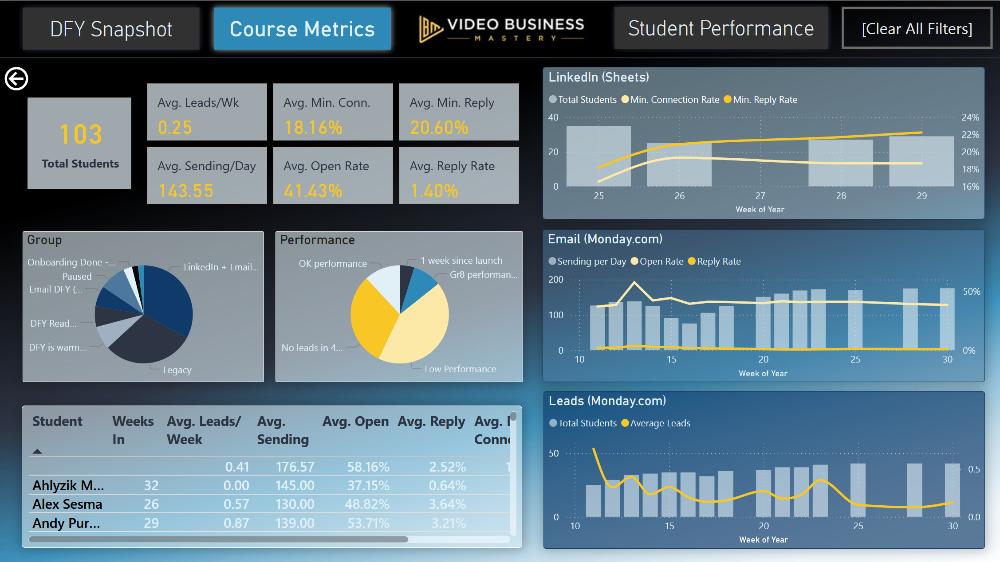

# Power BI Dashboard for Video Business Mastery

## Overview
VBM hired me to streamline their data analysis process, by bringing together a range of data sources and types into one place so that staff can rapidly get a feel for student performance and KPIs.

## Objectives
- Analyze existing data sources and construct a data pipeline.
- Bring together Monday.com, Google sheets, and ClickUp into PBI via API
- Clean data with DAX, establish hierarchies
- Create 3-page Dashboard: Overview, detailed metrics, and single-student summary.

## Key Insights
- Data entry needed a systematic approach formalising, to ensure long-term consistency.
- KPIs such as 'leads per week' for students did not correlate directly with time-in-course.

## Final Dashboard Preview

## Metrics Dashboard Preview

## Tools & Methods
- Power BI (DAX, data modeling, relationships, etc.)
- Data source(s): Google sheets, Monday.com, ClickUp

## Outcome / Impact
VBM reported that the dashboard reduced the typical time for staff to review course and student performance from 1hr to less than 20mins, and that it continued to be a great help 6+ months later.